# [MasterMindIQ](https://adampillis.github.io/MasterMind-IQ-Challenge/)

## 1. **Introduction**

### **What is it?**
MasterMindIQ is a general quiz designed to test the general knowledge of young adults from around the age of 16 and upwards. 
- The quiz application has a difficulty section of three levels and five general categories for the players to chose from to their liking.
- Each game consists of 10 questions with a player feedback at the end of each game which are score number specific. 

The **Project Aim** was to design a game that most age groups of online user can play if they wish so. *MasterMindIQ* was also designed to be as *interactive *with its players as possible and allowing them to *fully control* the type of game they each wish to play.
 A quiz game was chosen for this reason and five categories were included with three difficulty levels to match the interest and knowledge level of each player. The category topics are general rather than being specific to give players the opportunity and like the quiz game. If one can't answer any question because they're too related, they may lose interest and never return in the future. 

 ### **How it works?**
 1. The landing page welcomes the user and automatically starts interacting with them by asking them to enter their player name and either click the button or press 'Enter'. 
 2. This is followed by the menu page with a personalised message at the top with details taken from the form of the landing page. Underneath, each player can chose a difficulty level (easy level is automatically checked) followed by five general categories to include the interest of most players. 
 3. Once the player has clicked on their chosen category, a rule page pops up to explain the rules of the game before the actual game begins. The game includes a player score board showing the score, question number and number of incorrect answers. This is followed by the question and four possible answers with only one correct answer.
 4. Once the game is finished, i.e 10 questions have been answered, each player jumps to the end user feedback page where a warm welcome message awaits followed by their score number and based on that, a specific end comment. 

 ### **Who is it for**
The target audience is global and any user from the age of 16 has good potential to get a couple of questions correct. Another reason the creator build a quiz game was to include all age groups of the global target audience. 

**New User** : Each new user has the ability to play up to 15 games with different questions if they so wish. Each of the 5 categories consist of 3 levels of 10 questions. A young adult with secondary school knowledge should have the knowledge to test themselves on easy levels while medium and hard levels are designed for older generations. The landing page asks each player to enter a player name to personalise the game. 

**Returning User** : The chances of playing all 15 games during their first visit is low which means that as a returning user, other categories can be played at several difficulty levels. One of the first updates of this potential quiz game would be to implement APIs and expand the question database of each category to enhance the number of returning users. 

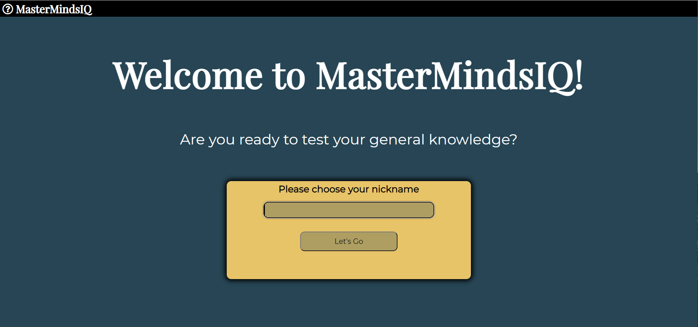

### **Planning**

The planning process started by designing one html page (**index.html**) with each page represented by a section. CSS and Javascript was then used to hide and display depending on what the user is clicking on. 

**1. Start-Screen Section**

**INCLUDE SCREENSHOT**

**2. Menu-Screen Section**

**INCLUDE SCREENSHOT**

**3. Rule-Screen Section**

**INCLUDE SCREENSHOT**

**4. Game-Screen Section**

**INCLUDE SCREENSHOT**

**5. Exit-Screen Section**

**INCLUDE SCREENSHOT**

**6. End-Screen Section**

**INCLUDE SCREENSHOT**

The creator has also made a rough sketch of functions he is going to use within his *script.js* to make the quiz game work. 

**Planning Functions Sketch**

**INCLUDE SCRENSHOT OF FUNCTIONS**

**Planning Colours**
The creator used [coolors.co](https://coolors.co/palettes/trending) website to chose six colors including a neutral body color, red for incorrect, green for incorrect and the rest for other parts and buttons. The colors he chose are as follows and used **hsl** in this project to test it out. 

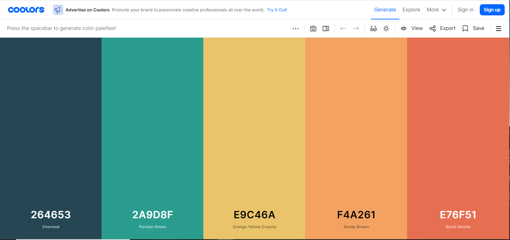

In terms of screen sizes, the creator used *flex-display* through each section to ensure that the game looks identical on every screen-size. As a result, the sketches for each section above also represent smaller and bigger screens using flex and different font and buttons sizes. 

## 2. **Features (existing)

### 1. **Landing Page**

#### *Header*
The *header* contains the quiz game's official name to the left and it is consistent by displaying in every page throughout the game.

#### *Landing page message*
Each user is greeted with a warm 'welcome message' followed by an inspiring quote which outlines one of the main functions of this project, *to test each visitor's general knowledge*.

#### *Landing page submit form*
The quiz game starts interacting with each user as soon as they land on the page. The text input of the form is focused on to indicate the user their action is necessary to continue. They cannot proceed if the input is left empty. Above the text input, is a label to ensure the user knows what they need to enter. The language used is just in-between form and informal language for an equal balance. 
Once the above step is complete and the **Let's go** button is pressed, JavaScript is used to hide the land-screen section and display the main menu. In terms of contrast and user friendly design, the body color is used to style the button and the font-size also increases when hovered over. Javascript has also been used to allow the **Enter button** to also work as this can be an automatic action by some users.

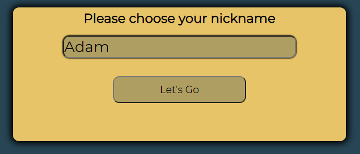

### 2. **Menu Page**

#### *Menu - Personalised Message*
Once the user submit's their form with their nickname, the *welcome message* will include their chosen name using JS followed by a brief guide as to what is expected from the user in order to continue. Warm language is used to inspire the player to *want* to play the quiz. 

#### *Difficulty level area*
Right under the welcoming message, there are three radio buttons - easy, medium and hard. The easy radio button is set to be checked automatically unless the user changes it to medium or hard. These radio buttons are used by JS to determine the difficulty level selected and this is one argument to source the correct array of questions. The styling has been kept clear and basic for ease of use by any age group. 

#### *Category Buttons*
Once the difficulty button is selected by the user, they each get to chose one of the five categories which is the second argument to determine which array of questions to use. The buttons use the same class to look identical with the same margin and padding. Each of these buttons is aria-labelled and have a unique ID which is linked with an event listener through JS. When hovered over, the text color changes and also increases in size for better visuals from a user perspective. 

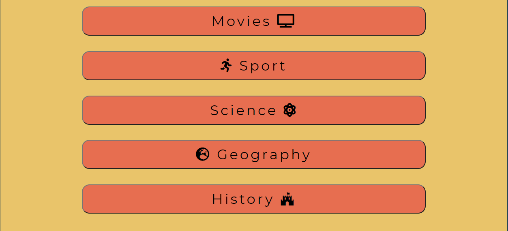

### 3. **Rules Page**

#### *Rules Box*
Consists of 4 rules altogether with an interactive message with the player to ensure they are all set and ready to play. The creator ensured that the user is also aware of current *in-game* features above the question container where their score, question number and incorrect answers are stored and monitored by JS in some functions. 

#### *Let's Go Button*
This button starts the game by hiding the rules-section and displaying the game-screen page with the first question and possible answers. When hovered over, the **color** of the text and background changes to enhance visual looks for the user. 

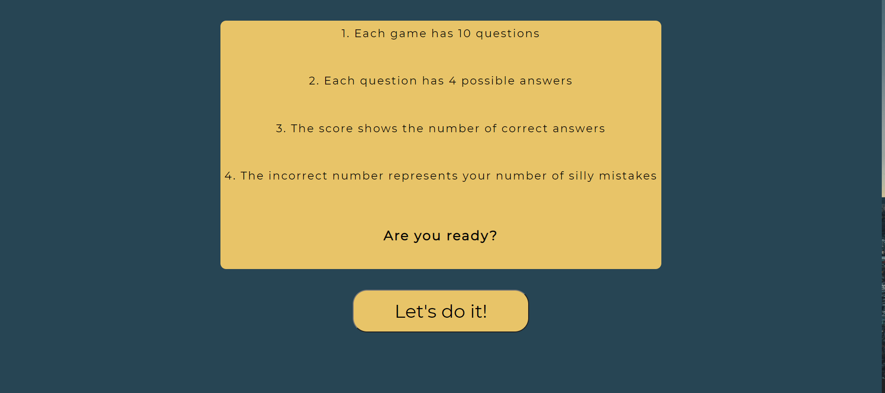

### 4. **In-game Page**
#### *Game Screen Header*
Within this page, a 'Door icon' is added to the *right-hand corner* of the header. This enables the user to exit the game whenever they wish while giving them full control of their time spent on the web application. This is the only section or page that is shown with an additional header feature. 

#### *Player Score Area*
Just above the quiz container, as outlined to the user in the rules section, this area provides information to the user which is also used by Javascript to create a message at the end of each game. 
The features it contains are:
- **Score counter** - For each correct answer, the score number increases by one.
- **Question Number** - This shows the question number being answer in the center and goes up to 10. 
- **Incorrect counter** - Displays the number of incorrect answers. 

Each of the above own a JS function to reset the number at the end of each game. 

#### *Quiz Container*
Contains the question and four possible answers attached to it. 
The possible answers are displayed in four buttons which are manipulated using JavaScript. The buttons are aria-labelled for better accessibility. 
The innerHTML of the question area and each of the four buttons is used by JavaScript to display each question of each array. When hovered over, the background changes for improved user visuality.

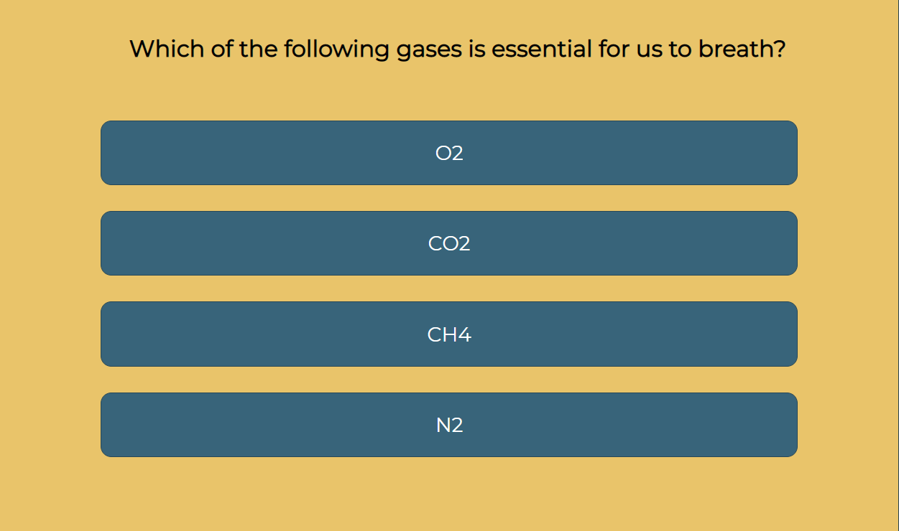

If the user clicks the correct answer, a JavaScript function displays the **hue correct** body and button colors.

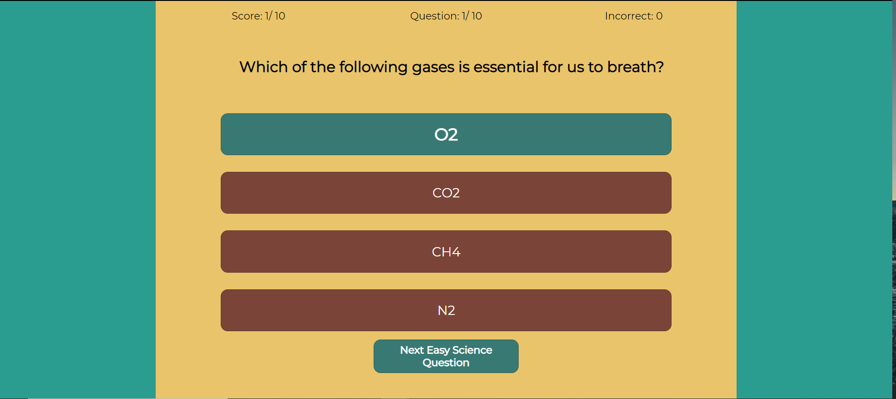

If the user clicks the incorrect answer, the same applies just displaying the **hue incorrect** color. 

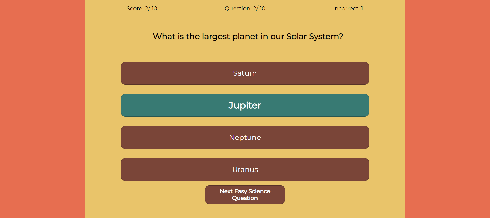

#### *Controls buttons*

- **Next Button** - Different innerHTML for every category and difficulty level. Sets the next question from the correct array based on the specific innerHTML string of the button which is manipulated in JavaScript. It is set to be hidden and to only display once the user clicked on an answer for better game flow. The background changes with the body color (red for incorrect and green if correct for more visual interactivity with each player). The button disappears every time it is pressed and reappears after every click. 

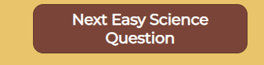

- **Finish Button** - At the end of the 10th question, the *next button* is set to be hidden and this button to be displayed instead which takes the player to the end page ('end-screen). Again, for consistency, the background is appears red if the 10th question was answered incorrectly and green if it was correct. 

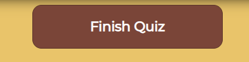

### 5. **Exit Page**
Activated when the **door icon** is pressed in the top right-hand corner within the header (hides game-screen and displays rules-section).

A small box pops up to double check the player wants to leave for sure. 

The box contains two buttons:
- Yes, to go back to the main menu.

or
- No, resume game by closing rules-screen and reopening game-screen section. 

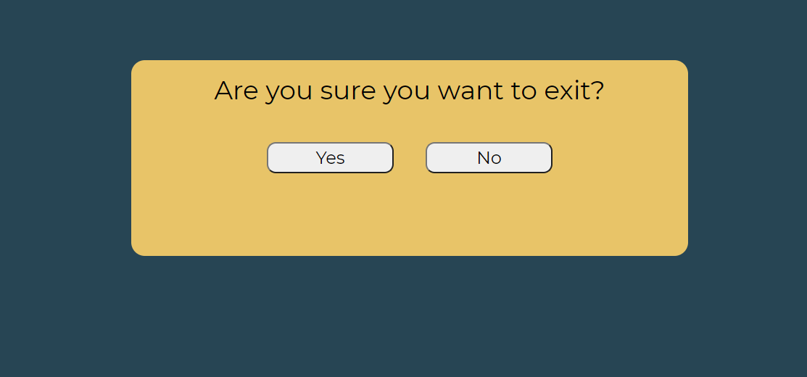

### 6. **End Page**
This page is called by JS function once the **finish button** is pressed. 
At the very top, an encouraging message highlights the player's effort for answering all of the questions to keep a warm atmosphere, even if they player scored very low. This is improved with an image of *smiley face* and a thumbs up.

This is followed by a displaying the players total score and the number of incorrect answers.

Based on the score number above, a personalised message is displayed to the player. For example, if they score 3 or less, the message displayed will be different as if they scored 9 or 10. 

At the bottom of this page, the player will find the final feature which is a button to *end the game* and return them to the main menu to play again. In terms of color contrast, the background color matches the neutral body color. 

## Features (new ideas) 
- Instead of manually typing every question into several variables in script.js, **APIs** will be used to increase the data base and the length of code required to run the game. For now, the creator was happy to do it this way to learn JavaScript. 
- Add two more **categories**
- Add an **easier** difficulty level to increase the target audience from secondary school level down as far as 8 or 9 years of age!
- Add a **challenging** difficulty level which will challenge most users.
- Add a timer which counts down in seconds. (30 seconds per question). 
- Add **background images** rather than just colours.
- Add *more specificity* to end user comments. i.e. different for each difficulty level. 

## 3. Testing and Bugs Fixed/Unfixed

## **Validator Testing**

This project, MasterMindIQ Challenge, has gone through several validation processes and passed with no issues or errors. 

**index.html** 

Validating site for HTML
[https://validator.w3.org/](https://validator.w3.org/)

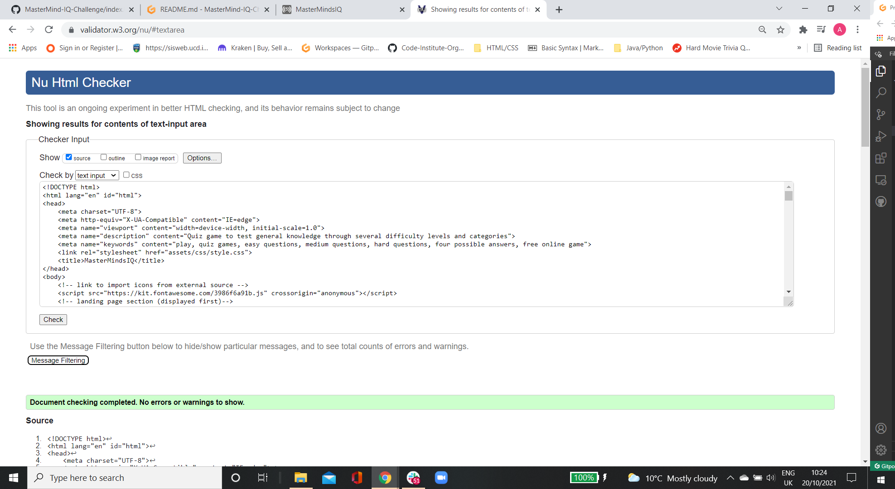

**style.css**

Validating site for CSS
[https://jigsaw.w3.org/css-validator/#validate_by_input](https://jigsaw.w3.org/css-validator/#validate_by_input)

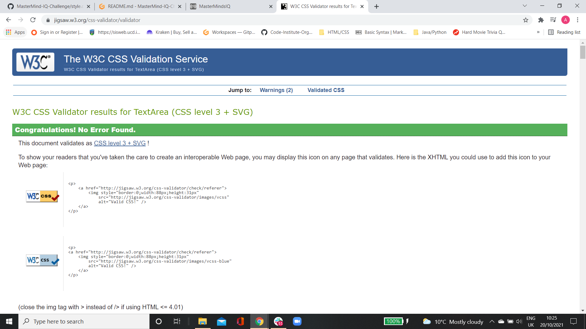

**script.js**

Validating site for JavaScript
[https://jshint.com/](https://jshint.com/)

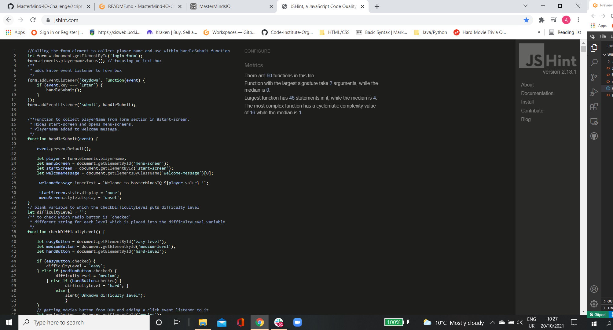

**Light-house Report**

Within DevTools, the lighthouse report was almost 100% in every category.

One yellow warning during the process which is to do with with user privacy and GitHub pages which I have no control of.

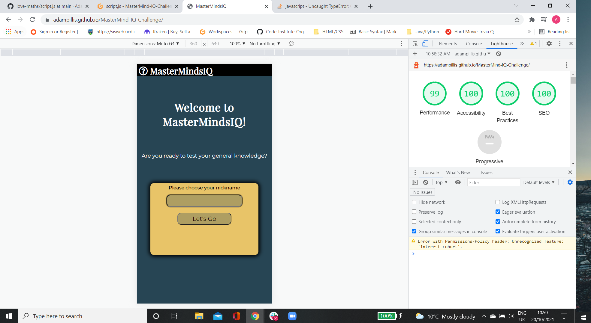

## 4. Deployment

For deployment, GitHub was used and the data was pushed from GitPod. 

The steps needed to take to deploy this project are as follows: 

1. Visit GitHub's official website.

2. In the top right-hand corner of the menu section, click on the **small array shown**, just above the icon. 

3. Select **Your Repositaries**.

4. Select **MasterMindsIQ Challenge Project**.

5. Just above the GitPod button, click on **settings**.

6. Scroll down to roughly 80% of the page and click on **GitHub Pages**.

7. From the *source section*, select **main branch**.

8. Click **save**.

9. Update the page and once the project is deployed, the link will show in *green* and ready for use. 

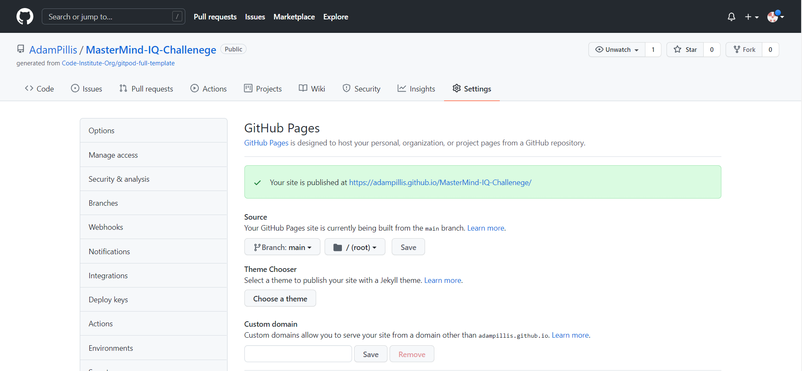

Click here for the offical GitHub link for this project 
[MasterMind-IQ-Challenge](https://adampillis.github.io/MasterMind-IQ-Challenge/)

## 5. Credits