# [MasterMindIQ](https://adampillis.github.io/MasterMind-IQ-Challenge/)

## 1. **Introduction**

### **What is MasterMindIQ?**
MasterMindIQ is a general, online quiz game designed to test the general knowledge of young adults from around the age of 16 and upwards. 
- The quiz game application has a difficulty section of three levels and five general categories for the players to chose from to their liking.
- Each game consists of 10 questions with a player feedback at the end of each game which are score number specific. 

The **Project Aim** was to design a game that most age groups of online user can play if they wish so. *MasterMindIQ Challenge* was also designed to be as *interactive *with its players as possible and allowing them to *fully control* the flow of the game they each wish to play.

 A quiz game was chosen for this reason and five categories were included with three difficulty levels to match the interest and knowledge level of each player. The category topics are general rather than being specific to give all players a balanced opportunity. If one can't answer any question because they're too related and it happens to be their weakness, then they may lose interest and never return in the future. The flow of the game has also been designed to be simplistic and minimise user confusion. 

 ### **How it works?**

 1. The landing section welcomes the user and automatically starts interacting with them by asking them to enter their player name and either click the button or press 'Enter'. 

 2. This is followed by the menu section with a personalised message at the top with details taken from the form of the landing page. Underneath, each player can chose a difficulty level (easy level is automatically checked) followed by five general categories to include the interest of most players. 

 3. Once the player has clicked on their chosen category, a rule section pops up to explain the rules of the game before the actual game begins. The game includes a player score board showing the score, question number and number of incorrect answers. This is followed by the question and four possible answers with only one correct answer.

 4. Once the game is finished, i.e 10 questions have been answered, each player goes to the end user feedback section once the **finish quiz** button is clicked. Here, another cheerful welcome message awaits followed by their score number and based on that, a *specific end comment*. 

 ### **Who is it for**
The target audience is global and any user from the age of 16 has good potential to get a couple of questions correct. It is simple to use and follow while the question types and difficulty levels ensure that all IQ levels are challenged at the same time.

**New User** : Each new user has the ability to play up to 15 games with different questions for now. Each of the 5 categories consist of 3 levels and 10 questions each per category. A young adult with secondary school knowledge should have the knowledge to test themselves on easy levels while medium and hard levels are designed for older generations. The landing page asks each player to enter a player name to personalise the game. In total, 150 questions should be enough to entertain each new user throughout their first visit to the game.

**Returning User** : The chances of playing all 15 games and and answer all 150 questions during their first visit is low which means that as a returning user, other categories can be played at several difficulty levels. One of the first updates of this potential quiz game would be to implement APIs and expand the question database of each category to enhance the number of returning users looking for a new challenge. 

### **Planning**

The planning process started by designing one html page (**index.html**) with each page represented by a section. CSS and Javascript was then used to hide and display depending on what the user is clicking on. 

**1. Start-Screen Section**

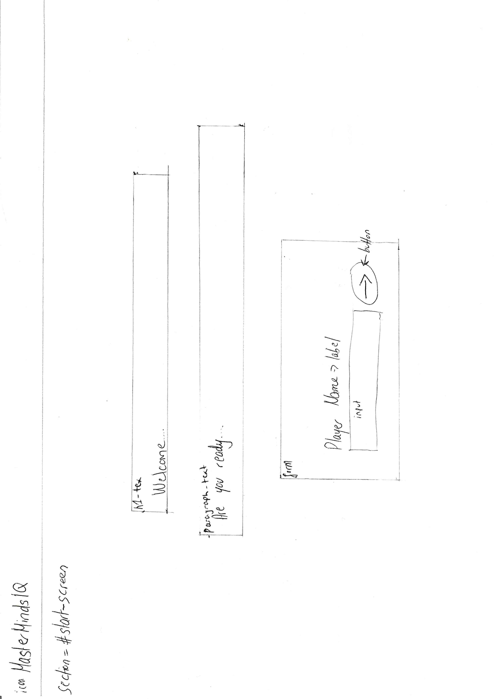

**2. Menu-Screen Section**

**3. Rules-Screen Section**

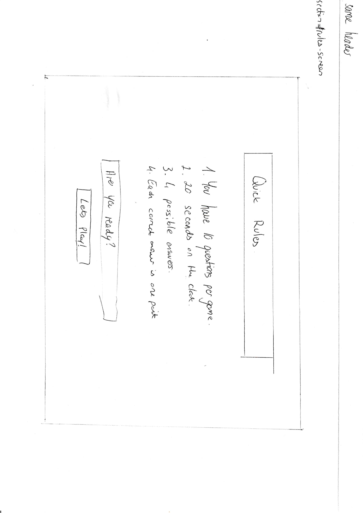

**4. Game-Screen Section**

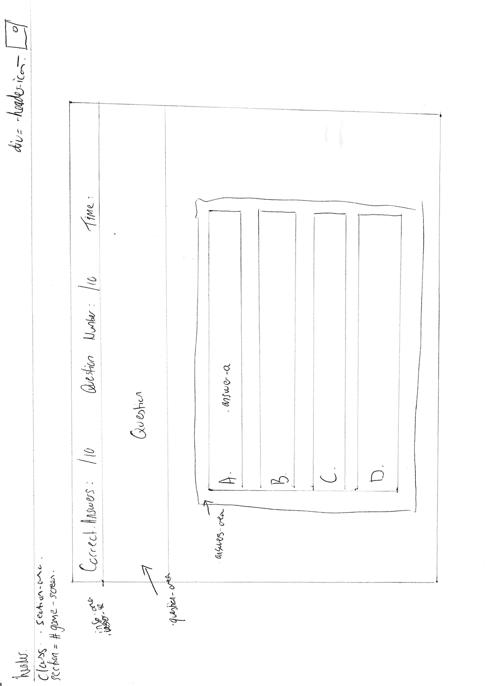

**5. Exit-Screen Section**

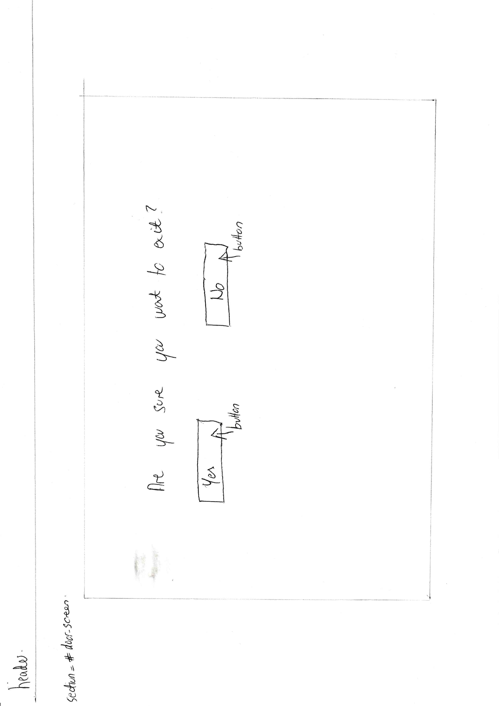

**6. End-Screen Section**

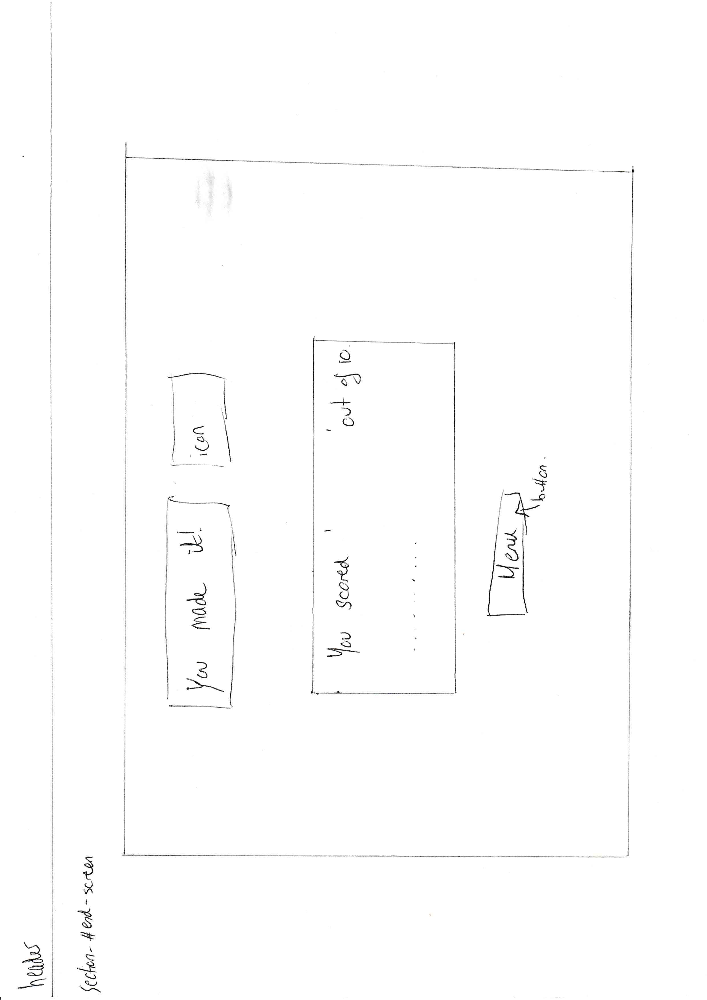

The creator has also made a rough sketch of functions he is going to use within his *script.js* to make the quiz game work. Of course, the idea and structure changed as he progressed through the project but the basic structure came from the sketch.

**Planning Functions Sketch**

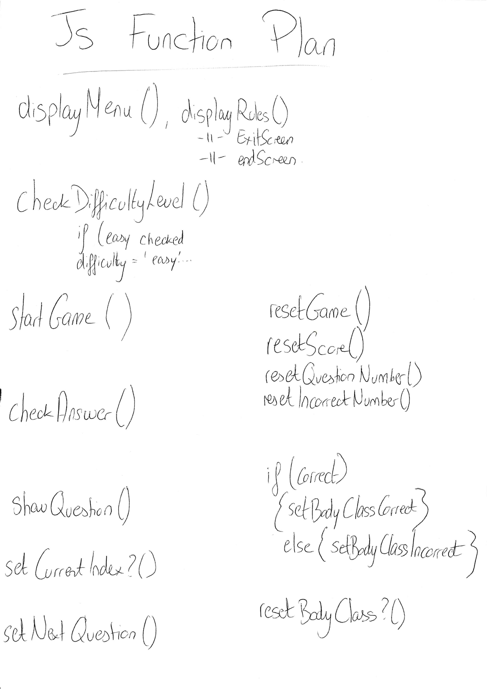

**Planning Colours**

The creator used [coolors.co](https://coolors.co/palettes/trending) website to chose six colors including a neutral body color, red for incorrect, green for incorrect and the rest for other parts and buttons. The colors he chose are as follows and used **hsl** in this project to test out the color type since he hasn't used it before.  

In terms of screen sizes, the creator used *flex-display* through each section to ensure that the game looks identical on every screen-size. As a result, the sketches for each section above also represent smaller and bigger screens using flex and different font and buttons sizes. 

## 2. **Features (existing)

### 1. **Landing Page**

#### *Header*
The *header* contains the quiz game's official name to the left and it is consistent by displaying in every page throughout the game.

#### *Landing page message*
Each user is greeted with a warm 'welcome message' followed by an inspiring quote which outlines one of the main functions of this project, *to test each visitor's general knowledge*.

#### *Landing page submit form*
The quiz game starts interacting with each user as soon as they land on the page. The text input of the form is focused on to indicate the user their action is necessary to continue. They cannot proceed if the input is left empty. Above the text input, is a label to ensure the user knows what they need to enter. The language used is just in-between form and informal language for an equal balance. 
Once the above step is complete and the **Let's go** button is pressed, JavaScript is used to hide the land-screen section and display the main menu. In terms of contrast and user friendly design, the body color is used to style the button and the font-size also increases when hovered over. Javascript has also been used to allow the **Enter button** to also work as this can be an automatic action by some users.

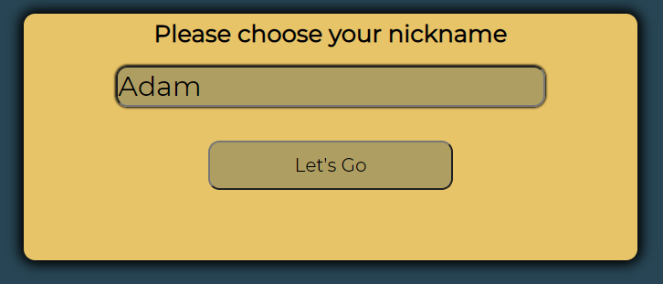

### 2. **Menu Page**

#### *Menu - Personalised Message*
Once the user submit's their form with their nickname, the *welcome message* will include their chosen name using JS followed by a brief guide as to what is expected from the user in order to continue. Motivational language is used to inspire the player to *want* to play the quiz. 

#### *Difficulty level area*
Right under the welcoming message, there are three radio buttons - easy, medium and hard. The easy radio button is set to be checked automatically unless the user changes it to medium or hard. These radio buttons are used by JS to determine the difficulty level selected and this is one argument to source the correct array of questions. The styling has been kept clear and basic for ease of use by any age group. 

#### *Category Buttons*
Once the difficulty button is selected by the user, they each get to chose one of the five categories which is the second argument to determine which array of questions to use. The buttons use the same class to look identical with the same margin and padding. Each of these buttons is aria-labelled and have a unique ID which is linked with an event listener through JS. When hovered over, the text color changes and also increases in size for better visuals from a user perspective. 

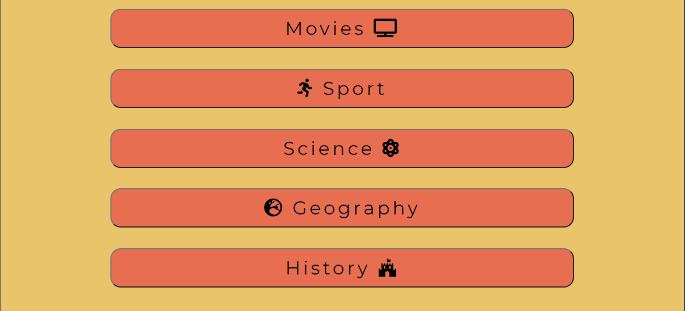

### 3. **Rules Page**

#### *Rules Box*
Consists of 4 rules altogether with an interactive message with the player to ensure they are all set and ready to play. The creator ensured that the user is also aware of current *in-game* features above the question container where their score, question number and incorrect answers are stored and monitored by JS in some functions. 

#### *Let's Go Button*
This button starts the game by hiding the rules-section and displaying the game-screen page with the first question and possible answers. When hovered over, the **color** of the text and background changes to enhance visual looks for the user. 

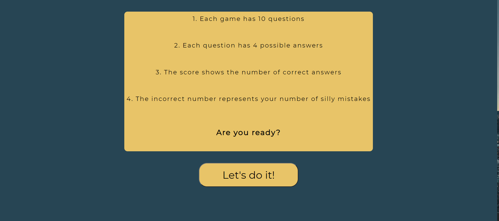

### 4. **In-game Page**
#### *Game Screen Header*
Within this page, a 'Door icon' is added to the *right-hand corner* of the header. This enables the user to exit the game whenever they wish while giving them full control of their time spent on the web application. This is the only section or page that is shown with an additional header feature. 

#### *Player Score Area*
Just above the quiz container, as outlined to the user in the rules section, this area provides information to the user which is also used by Javascript to create a message at the end of each game. 
The features it contains are:
- **Score counter** - For each correct answer, the score number increases by one.
- **Question Number** - This shows the question number being answer in the center and goes up to 10. 
- **Incorrect counter** - Displays the number of incorrect answers. 

Each of the above own a JS function to reset the number at the end of each game. 

#### *Quiz Container*
Contains the question and four possible answers attached to it. 
The possible answers are displayed in four buttons which are manipulated using JavaScript. The buttons are aria-labelled for better accessibility. 
The innerHTML of the question area and each of the four buttons is used by JavaScript to display each question of each array. When hovered over, the background changes for improved user visuality.

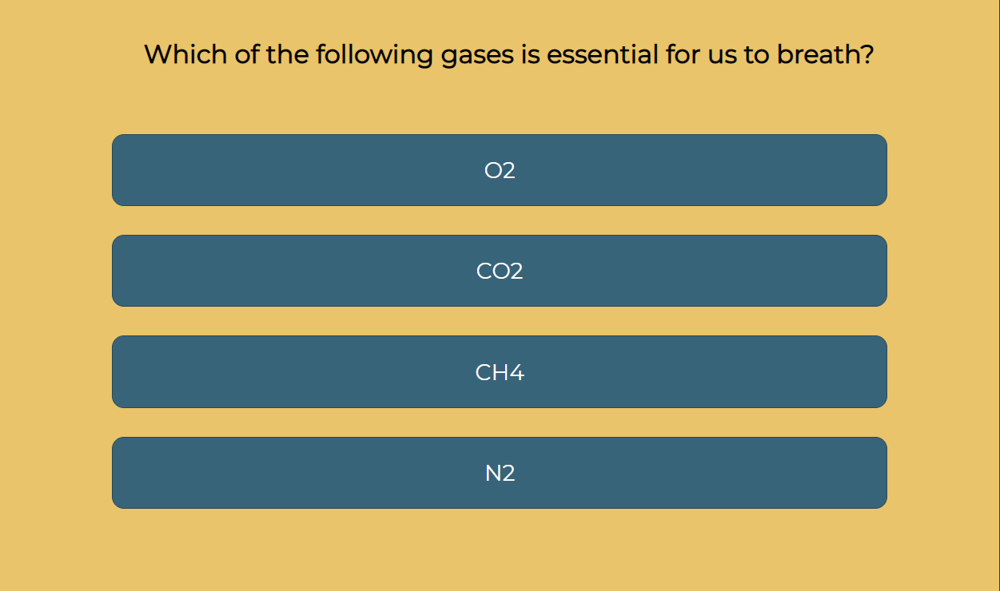

If the user clicks the correct answer, a JavaScript function displays the **hue correct** body and button colors.

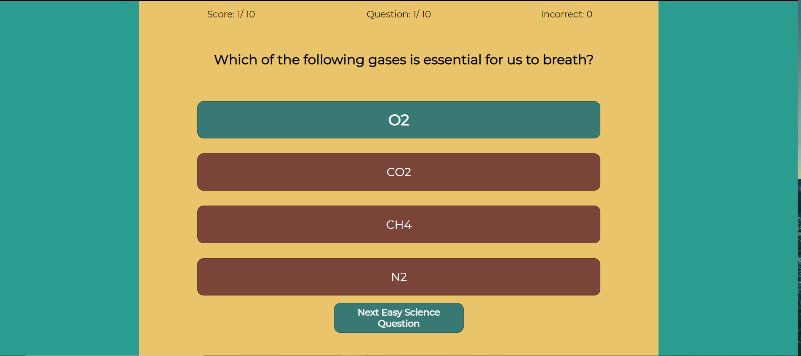

If the user clicks the incorrect answer, the same applies just displaying the **hue incorrect** color. 

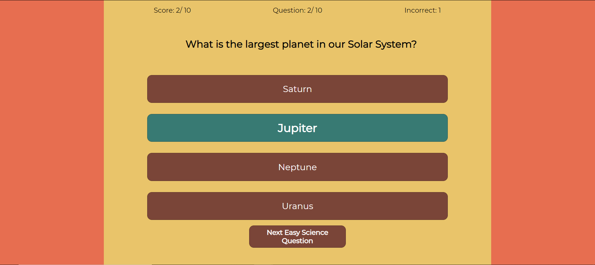

#### *Controls buttons*

- **Next Button** - Different innerHTML for every category and difficulty level. Sets the next question from the correct array based on the specific innerHTML string of the button which is manipulated in JavaScript. It is set to be hidden and to only display once the user clicked on an answer for better game flow. The background changes with the body color (red for incorrect and green if correct for more visual interactivity with each player). The button disappears every time it is pressed and reappears after every click. 

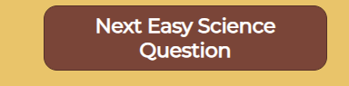

- **Finish Button** - At the end of the 10th question, the *next button* is set to be hidden and this button to be displayed instead which takes the player to the end page ('end-screen). Again, for consistency, the body's background appears red if the 10th question was answered incorrectly and green if it was correct. 

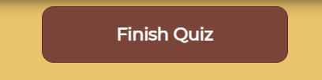

### 5. **Exit Page**
Activated when the **door icon** is pressed in the top right-hand corner within the header (hides game-screen and displays rules-section).

A small box pops up to double check the player wants to leave for sure. 

The box contains two buttons:
- Yes, to go back to the main menu.

or
- No, resume game by closing rules-screen and reopening game-screen section. 

### 6. **End Page**
This page is called by JS function once the **finish button** is pressed. 
At the very top, an encouraging message highlights the player's effort for answering all of the questions to keep a warm atmosphere, even if they player scored very low. This is improved with an image of *smiley face* and a thumbs up.

This is followed by a displaying the players total score and the number of incorrect answers.

Based on the score number above, a personalised message is displayed to the player. For example, if they score 3 or less, the message displayed will be different as if they scored 9 or 10. 

At the bottom of this page, the player will find the final feature which is a button to *end the game* and return them to the main menu to play again. In terms of color contrast, the background color matches the neutral body color. 

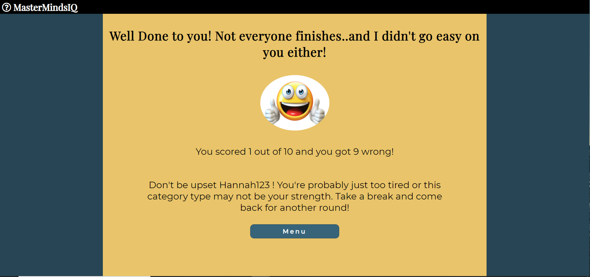

## Features (new ideas) 
- Instead of manually typing every question into several variables in script.js, **APIs** will be used to increase the data base and the length of code required to run the game. As a result, some of the JavaScript arrays and function are very repetitive but for now, the creator was happy to do it this way to learn JavaScript in detail. Along the way, he discovered shorter routes and also realised how one function can work instead of a several (For example **nextEasyMovieQuestion** x3 / categories and x5 for 5 categores) but it was too late make efficient changes and he has taken it as a learning curve. 
- Add more **categories** by making category buttons half the size for example. 
- Add an **easier** difficulty level to increase the target audience from secondary school level down as far as 8 or 9 years of age!
- Add a **challenging** difficulty level which will challenge most users.
- Add a timer which counts down in seconds. (30 seconds per question). 
- Add **background images** rather than just colours.
- Add *more specificity* to end user comments. i.e. different for each difficulty level. 

## 3. Testing and Bugs Fixed/Unfixed

## **Validator Testing**

This project, MasterMindIQ Challenge, has gone through several validation processes and passed with no issues or errors. 

**index.html** 

Validating site for HTML
[https://validator.w3.org/](https://validator.w3.org/)

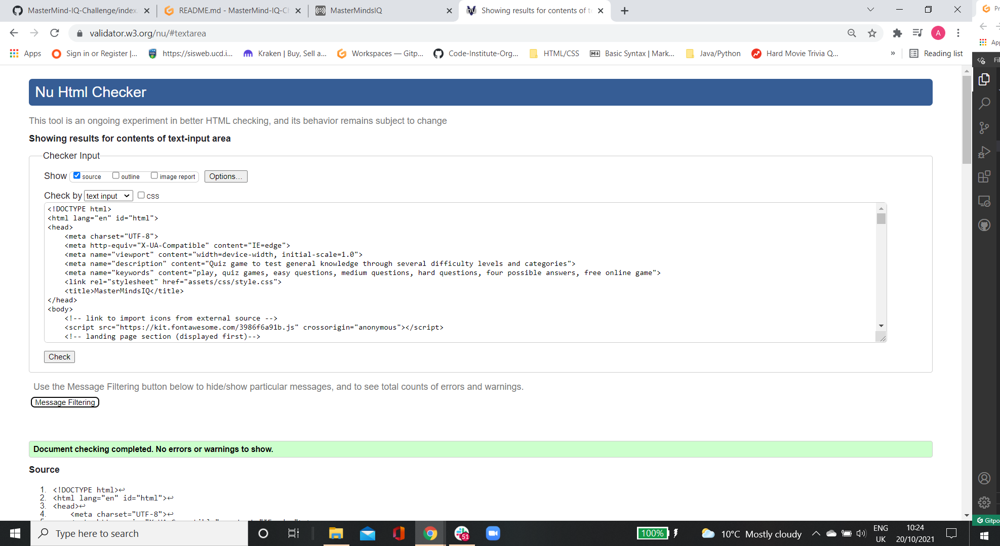

**style.css**

Validating site for CSS
[https://jigsaw.w3.org/css-validator/#validate_by_input](https://jigsaw.w3.org/css-validator/#validate_by_input)

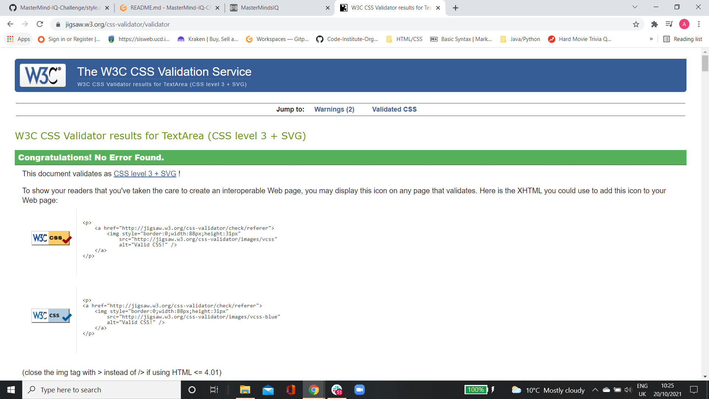

**script.js**

Validating site for JavaScript
[https://jshint.com/](https://jshint.com/)

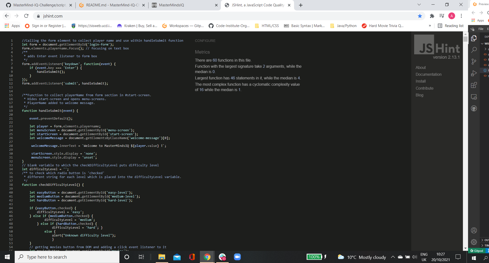

**Light-house Report**

Within DevTools, the lighthouse report was almost 100% in every category.

One yellow warning during the process which is to do with with user privacy and GitHub pages which the creator has no control over.

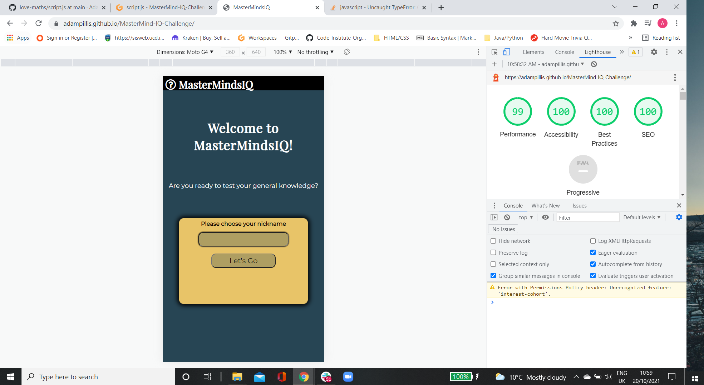

### **Testing colour contrast**

[https://webaim.org/resources/contrastchecker/](https://webaim.org/resources/contrastchecker/) was the site by the creator to ensure that the set of colors taken from *coolors.org* scored higher than 4. 

### **Search Engine Testing**

This project was tested through three several search engines including Google Chrome which is the creator's default search engine. Internet Explorer was not included below given its lack of popularity. 

1. **Google Chrome (default)**

2. **Mozilla Firefox**

Each section displayed as a page was tested and checked through *Mozilla Firefox* and no issues detected.

**Landing Section**

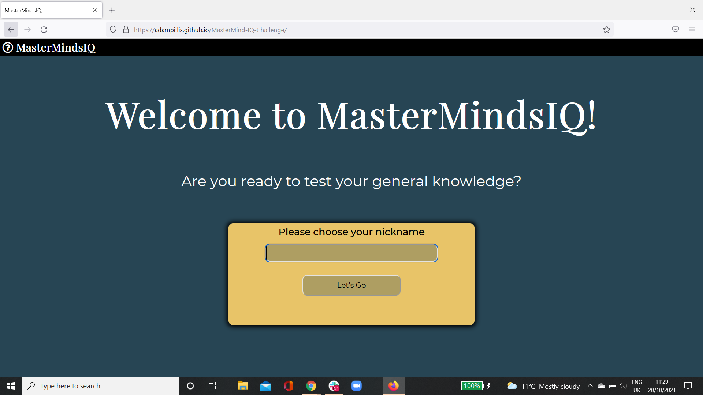

**Menu Section**

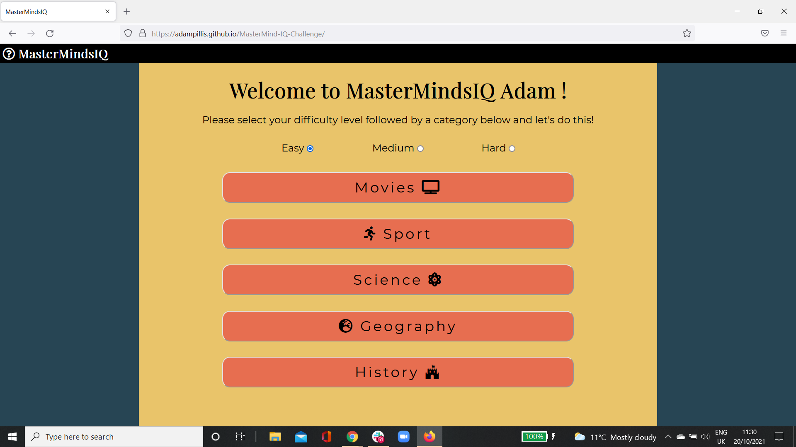

**Rules Section**

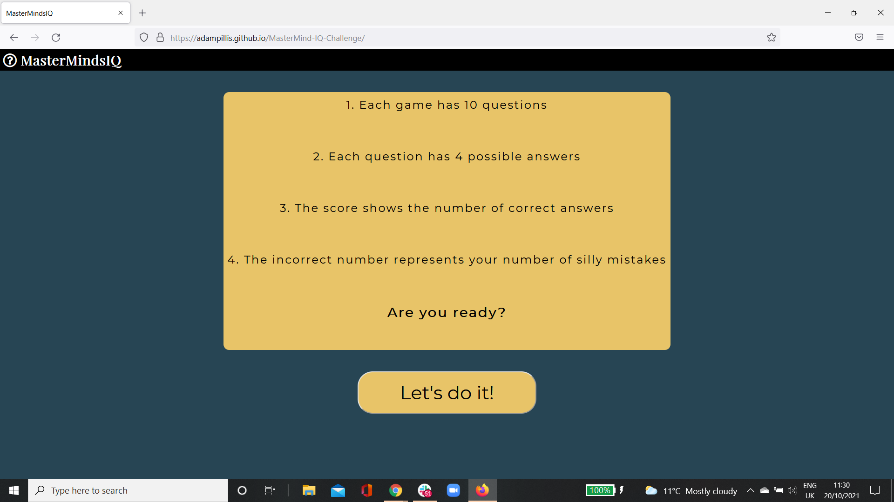

**Game Section**

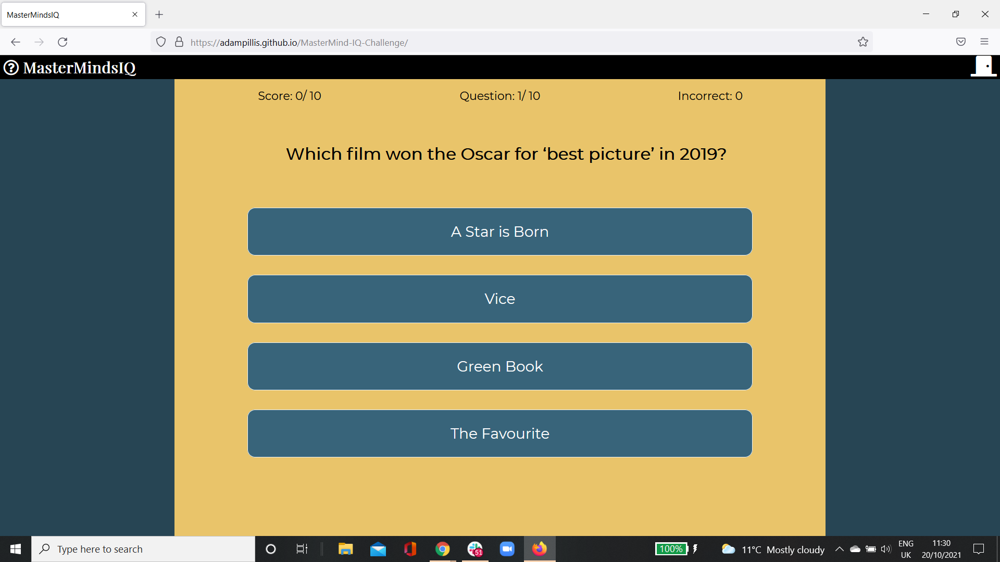

**Exit Section**

**End Section**

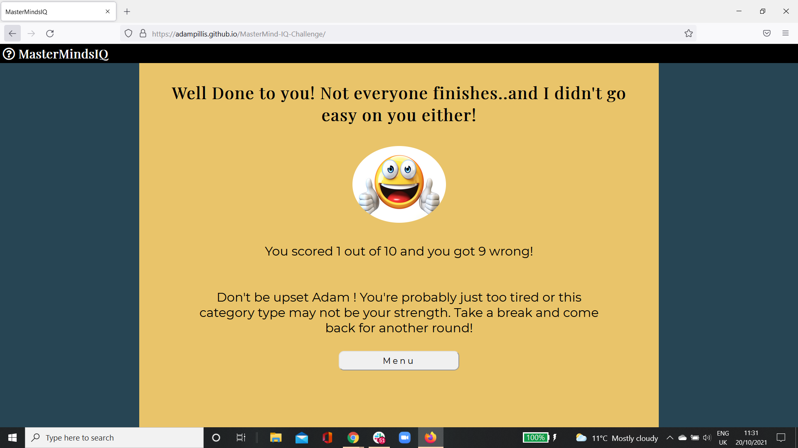

3. **Microsoft Edge**

Each section displayed as a page was tested and checked through *Microsoft Edge* and no issues detected.

**Landing Section**

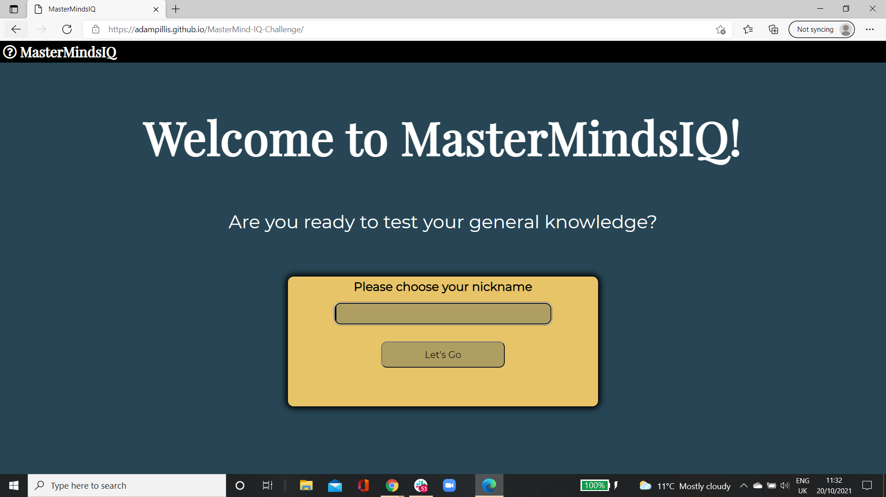

**Menu Section**

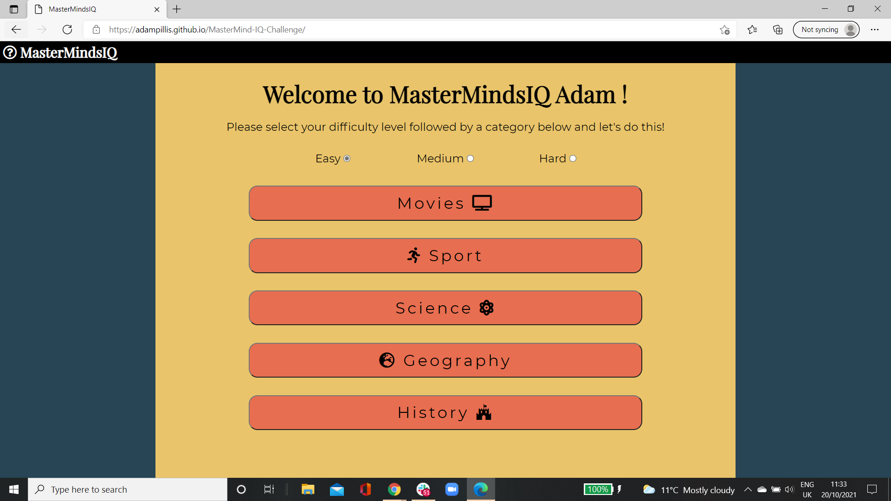

**Rules Section**

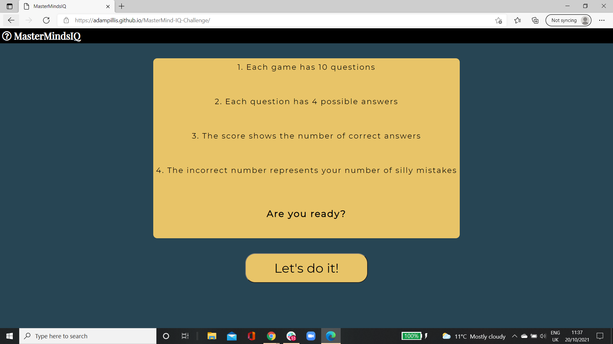

**Game Section**

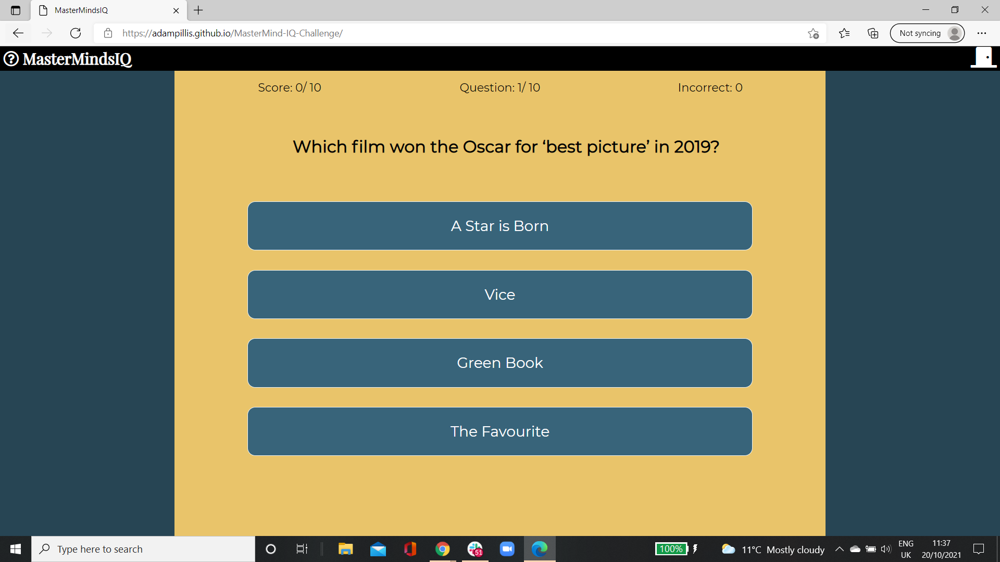

**Exit Section**

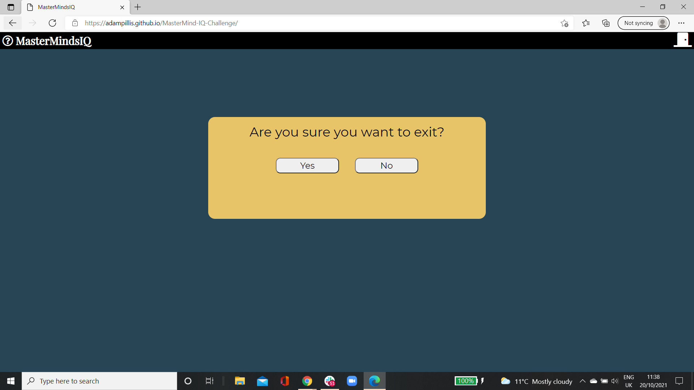

**End Section**

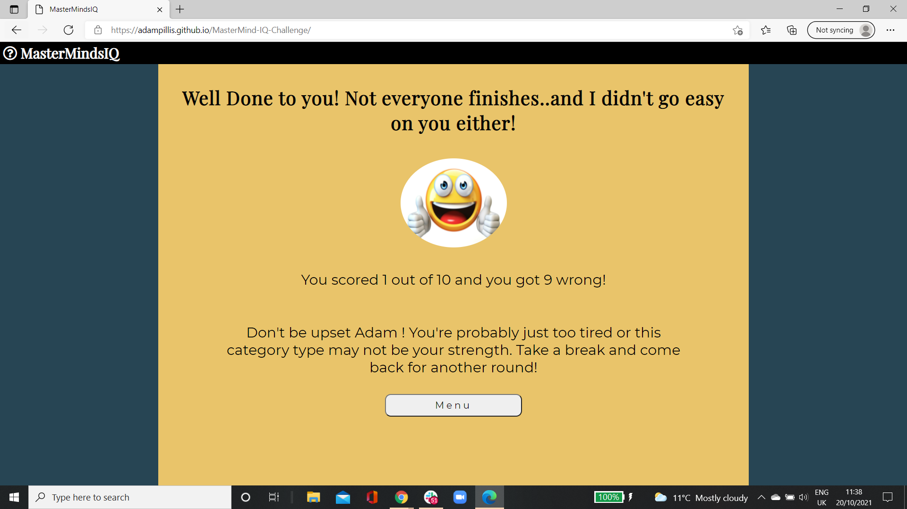

### **Application Features Test**

In terms of features and user interactivity, every showing section undergoes a test where the creator clicks and makes sure that everything works the way it should.

He analysed the quiz game through [http://ami.responsivedesign.is/](http://ami.responsivedesign.is/) to ensure he can check features through several screen sizes also. 

**1. Landing section features**

- **Input Text Box**
    - focused when page loads.
    - Does not allow empty box to be submitted.
    - Form submits when button clicked or if 'Enter' key is pressed.
- **Lets Go Button**
    - hides landing section and opening menu section = **true**
    - interactive when hovered over (color changes to body color) = **true**

**2. Menu section features**

- **Welcome Message**
    - name entered in form displays in welcome message correctly. = **true**

- **Difficulty Buttons**
    - Three radio buttons = **true**
    - Easy Radio button default = checked = **true**
    - Only one button can be checked = **true**

- **Category Buttons**
    - Each category button working perfectly (opening correct array) = **true**
    - Color and font-size change when hovered over each = **true**
    - When one is clicked, opens rules section = **true**

**3. Rules section features**

- **Let's do it button**
    - closes rules section and opens game section = **true**.
    - color change when hovered over = **true**

**4. game-section features**

- **header icon**
    - appears in top right corner (only in the game section) = **true**
    - opens door screen section if clicked = **true**
    - interactive when hovered over = **false** 
    (altered and now styled) = **true**

- **Question container**
    - question changes when next button clicked = **true**

- **Answers container**
    - four buttons (manipulated by JS - hide original buttons and create new buttons with answers within) = **true**
    - font size and light box shading when hovered = **true**
    - button changes to body.correct or body.incorrect when one of the answers is clicked = **true** 

- **Score-counter**
    - number increases by one for every correct answer = **true**
    - only increases if correct = **true**
    - resets when game exited through door screen = **true**
    -resets when 'Menu' buttons is pressed in end section = **true**

- **Question number counter**
    - Question number increases by one with every question = **true**
    - only increases if next button is clicked = **true**
    - resets when game exited through exit screen = **true**
    -resets when 'Menu' button is pressed in end section = **true**

- **Incorrect-counter**
    - number increases by one for every incorrect answer = **true**
    - only increases if incorrect = **true**
    - resets when game exited through exit screen = **true**
    -resets when 'Menu' buttons is pressed in end section = **true**

- **interactive body color change**
    - body color on both sides change when question answered = **true**
    - body.correct color applies if correct = **true**
    - body.incorrect color applies if incorrect = **true**
    - color resets to hue neutral when next question displayed = **true**

- **controls buttons**
    1. **Next Button**
        - Only appears when answer is clicked and checked = **true**
        - Changes color to body.correct or body.incorrect correctly = **true**
        - color resets to hue neutral when next question displayed = **true**
    
    2. **Finish Button**
        - only appears once 10th questions is answered = **true**
        - closes game section and opens end section if clicked = **true**
        - Changes color to body.correct or body.incorrect correctly = **true**
        - color resets to hue neutral when next question displayed = **true**       

**5. Exit section features**

- **Yes Button**
    - closes door section and opens menu section if clicked = **true**
    - changes background color when hovered over = **true**

- **No Button**
    - closes door section and re-opens game section on the last question if clicked = **true**
    - changes background color when hovered over = **true**
 
**6. End section features**
- Smiley image displaying and responsive to screen size = **true**
- Score number displayed correctly = **true**
- Incorrect number displayed correctly = **true**

- **Personalised Comment**
    - Responsive to score number = **true**
    - displays player name correctly = **true**

- **Menu Button**
    - Closes end section and opens menu section if clicked = **true**
    - background color changes when hovered over = **true**

### **Screen Responsive Testing**

For this online quiz game, [Am I Responsive](http://ami.responsivedesign.is/) website was used to test the application on several screen sizes. 

#### **Landing Section**

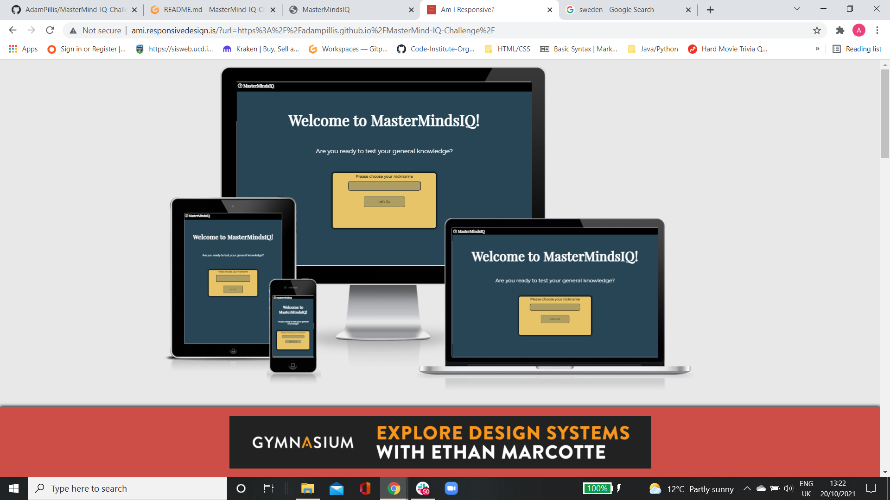

#### **Menu Section**

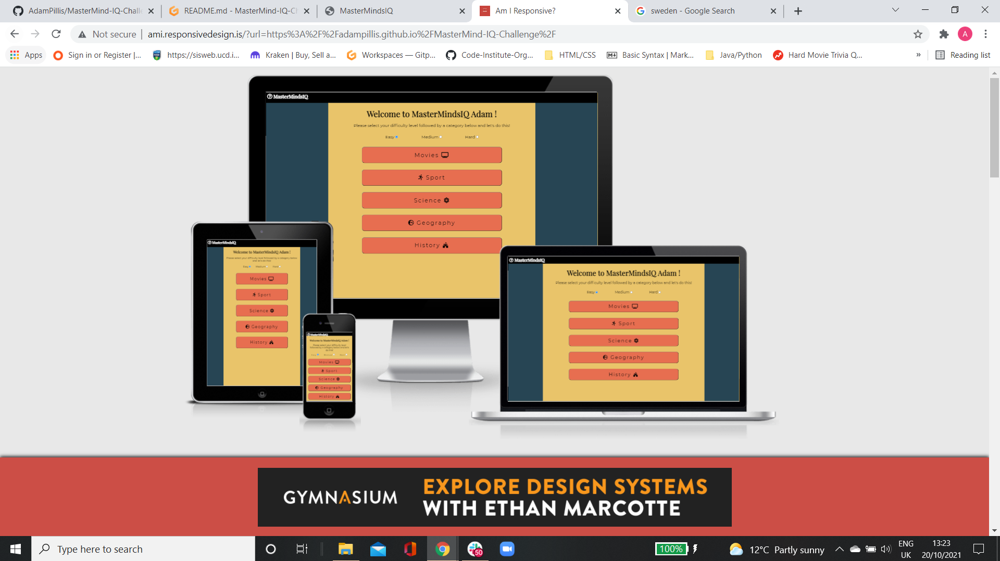

#### **Rules Section**

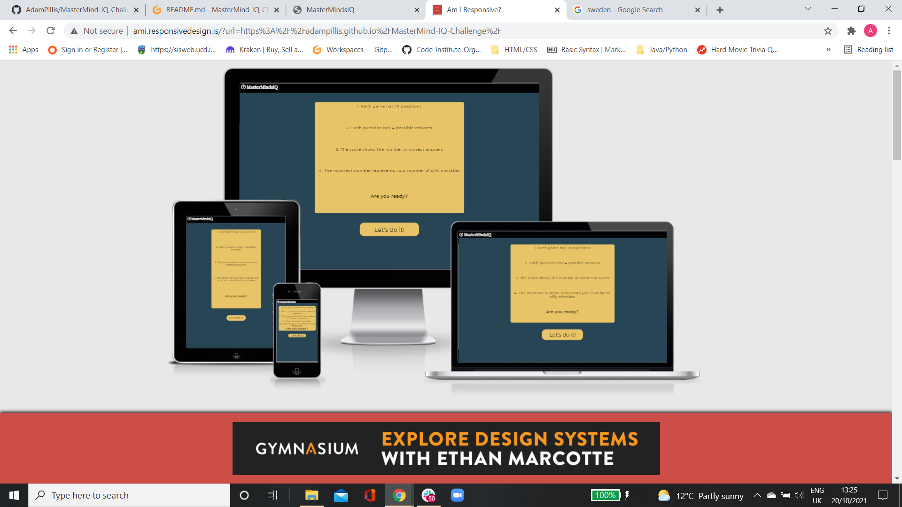

#### **Game Section**

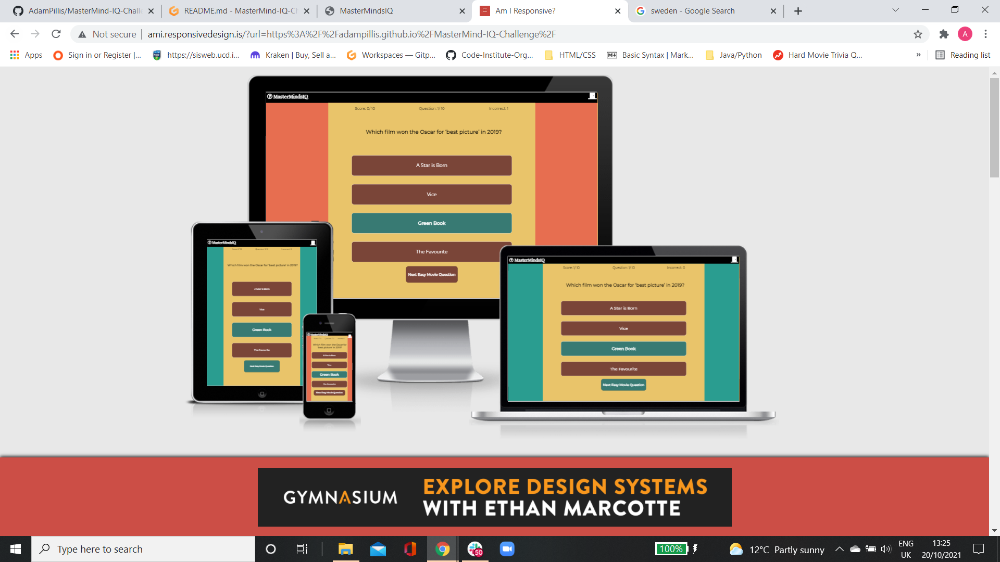

#### **Exit Section**

#### **End Section**

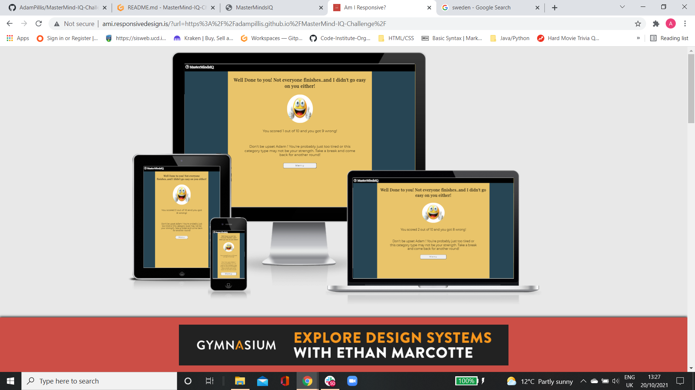

### **Other ways of testing responsiveness**

Multiple family members were asked to play the game on their mobile phones and overall, the iPhoneX wasn't fully responsive. The menu section only displayed on half the screen and for the iPhone4, the buttons over filled the screen size. Once the bugs have been identified, they were fixed and responding well now. It was also tested on a 20 inch screen to ensure it looks good visually for any user with large screens. 

### **Fixed Bugs**
1. The option buttons did not display the answers as wanted half way through the project. At last, hiding the original buttons with an empty innerHTML and creating new buttons using the same class but instead, filling the innerHTML with the answer, it fixed the issue and answers were showing correctly. 

2. The body.correct and body.incorrect color did not change back to neutral when the next question showed. A simple reset function fixed this issue. 

### **Unfixed Bugs**

Unfortunately, the project has one bug that the creator could not resolve before submission.

The optionButton within the quiz container are created with the innerHTML of answers within and an event listener is attached to each so when the user clicks an answer, the **checkAnswer function** is called. 

However, during testing, the creator realised that each button can be clicked on multiple times which affects the *score* and *incorrect counter*. He tried to use **.removeEventListener** in multiple places but the furthest he has got was he managed to disable them but then the score and incorrect score counter would not function and therefore, it further affects the end feedback. He tried to rearrange both the **checkAnswer** and **showQuestion** by implementing optionButtons.disable or optionButtons.removeEventListener but it caused futher glitches and bugs so in order for the game to be functual, he left the original project in place but unfortunately, this bug will need to solved at a later stage, post-submission. 

Other than this, no bugs or issues have been identified with this project. 

## 4. Deployment

For deployment, GitHub was used and the data was pushed from GitPod. 

The steps needed to take to deploy this project are as follows: 

1. Visit GitHub's official website.

2. In the top right-hand corner of the menu section, click on the **small array shown**, just above the icon. 

3. Select **Your Repositaries**.

4. Select **MasterMindsIQ Challenge Project**.

5. Just above the GitPod button, click on **settings**.

6. Scroll down to roughly 80% of the page and click on **GitHub Pages**.

7. From the *source section*, select **main branch**.

8. Click **save**.

9. Update the page and once the project is deployed, the link will show in *green* and ready for use. 

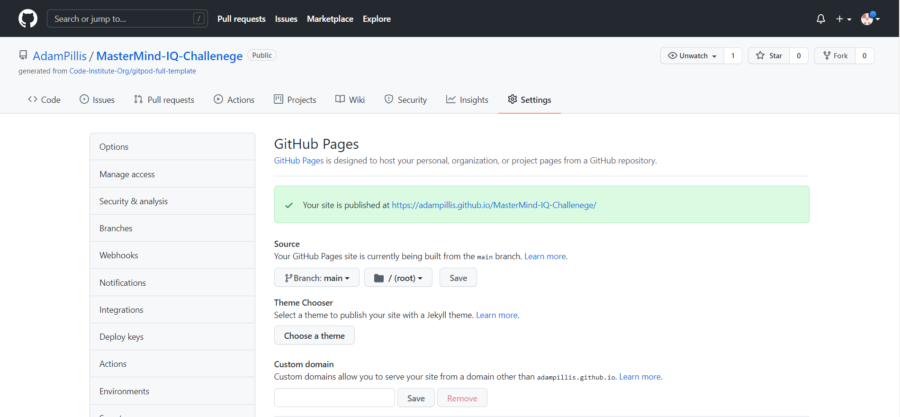

Click here for the offical GitHub link for this project 
[MasterMind-IQ-Challenge](https://adampillis.github.io/MasterMind-IQ-Challenge/)

## 5. Credits

### **Content**

#### **Questions and answers**

**Movie questions (easy, medium and hard)**

Taken from a YouTube quiz game

**Name**: MOVIE Trivia Quiz #1 | 40 Film Questions with Answers

**Link**: [https://www.youtube.com/watch?v=Zm0b0-u6VmE](https://www.youtube.com/watch?v=Zm0b0-u6VmE)

**Sports questions (easy, medium)**

Taken from *www.parade.com*

**Name**: 101 Sports Trivia Questions and Answers

**Link**: [https://parade.com/1182514/marynliles/sports-trivia/](https://parade.com/1182514/marynliles/sports-trivia/)

**Sports questions (hard)**

Taken from YouTube quiz game

**Name**: Sports Trivia Quiz | 10 Questions and Answers

**Link**: [https://www.youtube.com/watch?v=GzB5OFgJV44](https://www.youtube.com/watch?v=GzB5OFgJV44)

**Science questions (easy)**

Taken from YouTube quiz game

**Name**: 40 General Science Quiz General Knowledge Questions and Answers | Part - 1 (in English)

**Link**: [https://www.youtube.com/watch?v=lXgSeXezs6k](https://www.youtube.com/watch?v=lXgSeXezs6k)

**Science questions (medium and hard)**

Taken from YouTube quiz game

**Name**: 20 Trivia Questions (Science) No. 2

**Link** : [https://www.youtube.com/watch?v=VuXZHLsPELY](https://www.youtube.com/watch?v=VuXZHLsPELY)

**Geography questions (easy, medium and hard)**

Taken from YouTube quiz game

**Name**: 20 Trivia Questions (Geography) No. 1

**Link**: [https://www.youtube.com/watch?v=Uikjx5hkzXg&t=3s](https://www.youtube.com/watch?v=Uikjx5hkzXg&t=3s)

**Geography questions (hard)**

Taken from YouTube quiz game

**Name**: Geography Trivia (DIFFICULT)

**Link**: [https://www.youtube.com/watch?v=lDdo19f0UAU&t=1123s](https://www.youtube.com/watch?v=lDdo19f0UAU&t=1123s)

**History questions (easy)**

Taken from YouTube quiz game

**Name**: Quiz: History Questions and Answers | Fun Fact Trivia

**Link**: [https://www.youtube.com/watch?v=HQ3qJD_V8O4](https://www.youtube.com/watch?v=HQ3qJD_V8O4)

**History questions (medium and hard)**

Taken from YouTube quiz game

**Name**: 20 Trivia Questions (History) No. 1

**Link**: [https://www.youtube.com/watch?v=Otq0lMCFBfk](https://www.youtube.com/watch?v=Otq0lMCFBfk)

#### **Smiley-face image in end-section**

**Owner**: News Talk WBCK 

**Link**: [https://wbckfm.com/battle-creeks-smiley-face-tagger-says-he-is-ready-to-face-consequences/](https://wbckfm.com/battle-creeks-smiley-face-tagger-says-he-is-ready-to-face-consequences/)

#### **Slack Community**
- Inspiration for hiding and displaying sections using JavaScript realised by talking to others in **#Portfolio 2** group chat. 

#### **Idea Inspiration**
1. YouTube video related to quiz

**Name:** Build A Quiz App With JavaScript

2. Love Maths Project inspired the creator how Javascript connects functions and buttons. 

Inspiration to hide buttons and change body colour came from video below:

**Link:** [https://www.youtube.com/watch?v=riDzcEQbX6k&t=488s](https://www.youtube.com/watch?v=riDzcEQbX6k&t=488s)

#### **Color Inspiration**

**Name:** www.coolors.org

**Link:** [https://coolors.co/palettes/trending](https://coolors.co/palettes/trending)

#### **W3Schools.com**

Used throughout the project 

For example ==>

**How to use arrow functions (short-hand)**
*Link* - [https://www.w3schools.com/js/js_arrow_function.asp](https://www.w3schools.com/js/js_arrow_function.asp)

#### **Code Institute's Online Learning System**

Returned to and used throughout the project

For example, firstly it helped with creating the form element within the landing section.

**Name of module** : JavaScript & the DOM 

**Name of lecture** : Working with Forms

